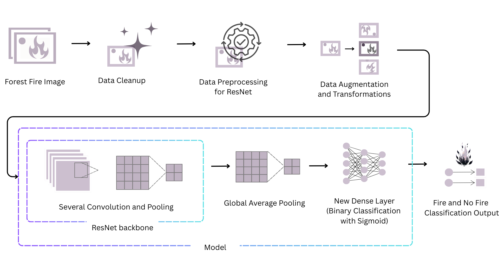
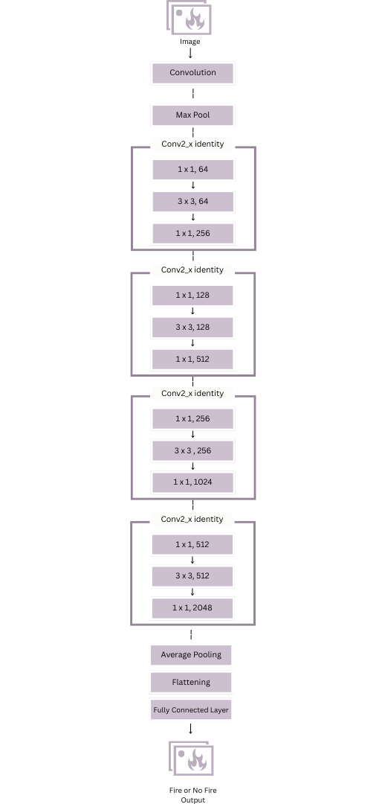
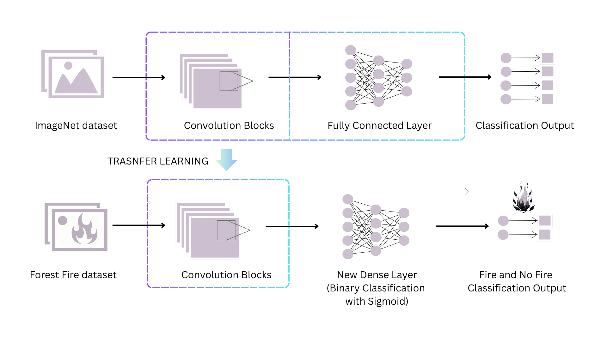

# 🌲 Forest Fire Detection System

A deep learning–based computer vision system for detecting forest fires from images.  
This project aims to support early wildfire detection to reduce environmental damage and improve emergency response.

* Image-based fire detection using deep learning with ResNet 50 
* Binary classification (Fire / No Fire)  
* Data preprocessing and augmentation  
* Model training and evaluation pipeline  
* Prediction on new images  
* Potential for real-time deployment  

# Architecture Diagrams
Pipeline

Model Layers

Transfer Learning